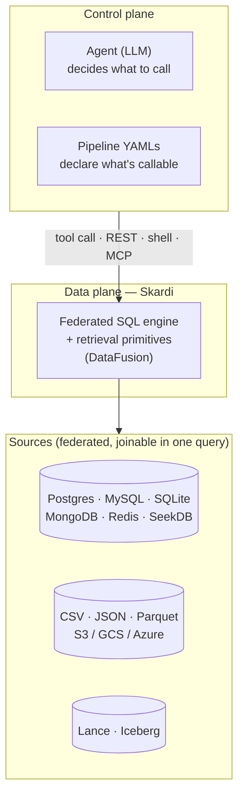

# Why an Agent Data Plane

> Skardi is an agent data plane that gives AI agents data autonomy. One execution engine over every data source — build RAG, hybrid search, memory, and data APIs in plain SQL.

## The thesis in one page

Agents are not bottlenecked by intelligence. They're bottlenecked by **data autonomy** — the ability to pick the right data, query it, join across it, write to it, remember from it, and do all of that without a human hand-wiring each step.

Today's data stack was built for humans writing queries and ops teams maintaining pipelines. Hand an LLM a raw schema dump and it hallucinates column names. Hand it a bag of bespoke REST endpoints and it can't compose them. Hand it a vector store and it still can't `JOIN` the result against a Postgres table. Every agent framework patches around this with brittle, app-specific glue.

The fix isn't another agent framework. It's an **agent data plane** — the request path every agent tool call traverses. Your agent and your pipeline YAMLs are the *control plane*: they decide what to ask for. Skardi is the *data plane* that serves it: federated SQL over every source you already have, exposed as REST and shell, with retrieval primitives built in.

Or, by analogy:

- **Spark** gave data teams a single execution engine that worked over every storage format — HDFS, Parquet, Hive, JDBC, Iceberg — with one DataFrame API. Before Spark, every source had its own SDK and every join was a multi-day project.
- **Skardi** gives agents the same shape, but tuned for the request path: one DataFusion-based engine that federates CSV, Parquet, S3, Postgres, MySQL, SQLite, MongoDB, Redis, Iceberg, Lance, and SeekDB; one declarative YAML format covering both online serving and offline jobs, projecting out to REST, shell, skills, and MCP; one set of SQL primitives (`candle()`, `pg_knn`, `pg_fts`) agents actually need.

That's what we mean by "Spark for Agents" — borrowing the *shape* (one engine over every source) but not the workload. Spark targets large-scale analytics; Skardi targets the request path of agent tool calls.

---

## Why an agent data plane is the right primitive, not "another agent framework"

Agent frameworks sit above the model and below the UX. They orchestrate tool calls. That's valuable, but it's not where the hard problem is — every framework has the same "how do I give my agent real data" chapter, and they all handle it by gluing together a vector DB, a SQL DB, and a pile of REST wrappers.

The hard problem lives underneath. It's the data layer.

- **An agent cannot be autonomous if every new dataset requires a human to wire up an embedding pipeline, an index, and a query API.** Skardi's embedding UDF puts embedding inference directly inside SQL; `pg_knn` / `sqlite_knn` / Lance vector columns put retrieval in the same plan. One statement embeds, stores, and indexes.
- **An agent cannot reason across data if every source has its own dialect and SDK.** Skardi is one SQL over eleven source types, with real `JOIN`s across them. That includes joining a Lance vector table against a Postgres reference table against a CSV of new inputs — in one query, in one process.
- **An agent cannot discover tools if every endpoint is a hand-crafted one-off.** Skardi's pipeline YAML is the single source of truth — one file becomes a REST endpoint today, a `skardi run` shell command today, a Claude skill tomorrow, and an MCP tool shortly after. All surfaces stay in lockstep because they derive from the same spec.
- **An agent cannot do durable work if every write is a fire-and-forget HTTP call.** Skardi's offline jobs primitive commits async writes to Lance or a DB with a run ledger, submit / poll / cancel, crash recovery, and atomic failure semantics.

None of the above is a model-level capability. All of it is data-plane plumbing. It's what Databricks built for humans and what nobody has built for agents yet. That's the gap.

---

## Design principles

Every decision in the repo traces back to one of these.

### 1. Online serving and offline jobs, one declarative shape

Agents need both sides of the online/offline split: low-latency reads at tool-call time, and durable writes that commit somewhere queryable later. Skardi covers both with the same parameterized-SQL shape — **pipelines** serve SQL synchronously (the online-serving side), **jobs** run the same SQL asynchronously into a durable destination (Lance or a read-write DB) with a run ledger, atomic commit, submit/poll/cancel, and crash recovery (the offline-batch side).

Both project to the same agent-facing bindings — HTTP today, shell today, Claude skills in v0.1, MCP in v1.1 — so an agent reading live data via a skill and running a backfill via `skardi job run` is using the same machinery both times. Adding a new surface is one codegen over both primitives, never two separate integrations.

### 2. Primitives shaped for agents, not humans

Humans tolerate 20-line RRF queries; they write them once and reuse them. Agents don't — every token of SQL they generate is a token they can get wrong, and every extra step is a place the tool loop can derail.

So we ship shape-shifting primitives:

- **embedding UDFs** — embedding inference inline in SQL. Agents don't wire an embedding service; they write something like `gguf('model-path', content)` and move on.
- **`pg_knn` / `sqlite_knn` / `pg_fts` / `sqlite_fts`** — vector and text retrieval as SQL functions, joinable like any other relation. Hybrid search (RRF) is a JOIN, not a separate system.
- **Online serving and offline jobs, one YAML shape** — the same parameterized SQL either answers synchronously over REST or commits asynchronously to a durable destination. Durable agent writes are a YAML declaration, not an orchestration framework.
- **Memory primitive** (roadmap, v1.1) — hybrid access + TTL + provenance + consolidation collapsed into one declarative macro that expands to the right tables and pipelines.

The test for "should this be a primitive" is: *would an agent need to hand-assemble three-to-five SQL statements to do this?* If yes, it's a primitive candidate. If no, it's application code.

### 3. Ship where agents already are

The MVP deliberately doesn't require MCP, Claude Desktop, or a hosted service. The fastest path to "agent using skardi" is:

1. Install the CLI.
2. Drop it into a Claude Code / Cursor / custom-agent session that already has a Bash tool.
3. Agent runs `skardi run pipeline --param=…` or `skardi grep "…"`.

That works today, end to end. MCP, skills generation, and auto-discovery are layering on top of that foundation — they strictly add reach, not enable it. This is also why the MVP audience is *developers building agents*, not end-users of chat apps. Developers are exactly the audience Spark's first wave landed with.

### 4. Trust the agent, but make writes safe

Agent autonomy cuts both ways. An agent that can write to the lake can also corrupt it. Our answer is not to gate writes on human approval — that defeats autonomy — but to make the write path **atomic and recoverable** so mistakes don't cause damage:

- **Lake destinations (Lance, Iceberg-roadmap)** commit atomically at end of batch. A crashed or cancelled run leaves the previous version visible.
- **Submit-time pre-flight** diffs the query's output schema against the destination before creating a run row. Agents can't silently drift the schema.
- **Run ledger** records every run in SQLite with parameters, status, rows_written, snapshot_id. Every agent-caused write is auditable by construction.
- **Branching** (roadmap, v1.2) turns agent experiments into cheap `git checkout`-equivalents via Iceberg/Lance snapshots.

The OSS primitives are designed so governance is *additive*, not a retrofit — governance (row/column grants, quotas, per-agent audit) lives on top of the metadata capture and snapshot primitives, rather than replacing them.

---

## Roadmap — see the README

The full public roadmap, with live checkboxes for what's shipped vs in flight vs open, lives in the [main README](/docs/roadmap). We keep it there so anyone who lands on the repo sees exactly where the project is.

---

## What an agent data plane is not

A few comparisons that sound similar but are deliberately off-mission:

- **Not "MCP server framework."** MCP is a binding we ship (v1.1); it is not the product. Pipeline YAML is the product. If MCP gets replaced by a better protocol tomorrow, our YAMLs still describe the right tools.
- **Not "another vector DB."** We integrate with pgvector, sqlite-vec, Lance, SeekDB HNSW — we don't ship a new vector store. The primitive is "hybrid retrieval in SQL," not "yet another ANN index."
- **Not "an agent framework."** We have zero opinions about tool loops, planners, or routers. Bring your own agent. We just make the data layer work.
- **Not "an LLM gateway."** `llm()` as a UDF is on the v1.2 roadmap, but the MVP deliberately stays out of provider / key / cost / caching decisions.

---

## Get involved

We're building in public. If the thesis above resonates — or if it doesn't — we want to hear it.

- **[Discord](https://discord.gg/S5YQQPEV2m)** — ongoing conversation, POC help, roadmap feedback.
- **[GitHub issues](https://github.com/SkardiLabs/skardi/issues)** — file against any unchecked roadmap item; we'll pair on design and review.
- **[skardi-skills](https://github.com/SkardiLabs/skardi-skills)** — a growing library of ready-to-use Skardi setups.

The rest of this doc tree walks the concrete pieces:

- [Server](/docs/server) — the HTTP process that hosts both peer surfaces.
- [Pipelines](/docs/pipelines) — online serving (parameterized SQL as REST).
- [Jobs](/docs/jobs) — offline jobs (async batch writes to Lance or a DB).
- [CLI](/docs/cli) — `skardi run`, aliases, federated SQL from the shell.
- [llm_wiki demo](/docs/demos/llm-wiki) — the fullest end-to-end demonstration of agent autonomy on Skardi.
